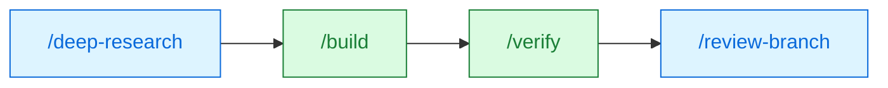
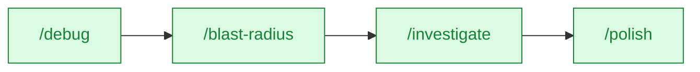
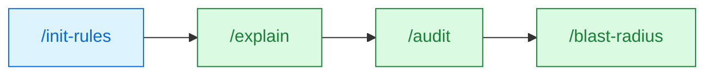
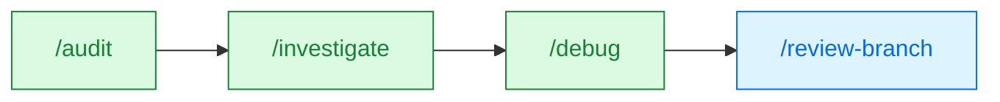
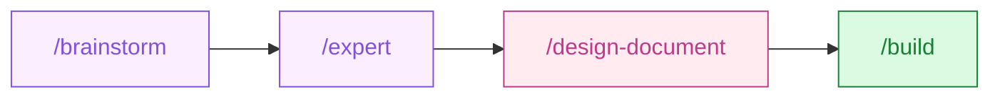
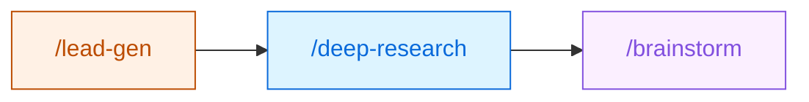
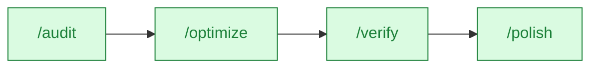
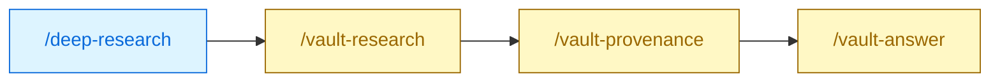

# mozg-pipelines

Multi-agent plugins for [Claude Code](https://claude.com/claude-code). Autonomous development pipelines, code review, deep research, and business intelligence — all as slash commands.

## Workflows

> [!TIP]
> Skills compose. Most real tasks span 3–4 commands across multiple plugins — chain them end-to-end instead of reaching for any single skill in isolation. Click any workflow below to see the flow.

<details open>
<summary><b>Ship a new feature end-to-end</b> &nbsp;·&nbsp; <code>mz-dev-base</code> + <code>mz-dev-pipe</code></summary>



1. **`/deep-research`** — survey trade-offs, cite references, pick an approach
1. **`/build`** — research → plan (approval gate) → parallel code → review → test
1. **`/verify`** — lint + types + tests + coverage, diagnose failures
1. **`/review-branch`** — independent final pass before opening the PR

</details>

<details>
<summary><b>Hunt a production bug</b> &nbsp;·&nbsp; <code>mz-dev-pipe</code></summary>



1. **`/debug`** — reproduce → regression test → diagnose → fix → verify
1. **`/blast-radius`** — map every caller, test, and type at risk of the patch
1. **`/investigate`** — prove or disprove "does the same race exist on the refund path" without touching code
1. **`/polish`** — fix-test-review loop until the criteria are met

</details>

<details>
<summary><b>Take over a legacy codebase</b> &nbsp;·&nbsp; <code>mz-dev-base</code> + <code>mz-dev-pipe</code></summary>



1. **`/init-rules`** — install curated coding rules for the detected languages
1. **`/explain`** — multi-angle walkthrough with Mermaid diagrams of the module
1. **`/audit`** — ranked list of landmines and tech-debt hotspots
1. **`/blast-radius`** — know what shatters before the first refactor commit

</details>

<details>
<summary><b>Security sweep and remediation</b> &nbsp;·&nbsp; <code>mz-dev-pipe</code> + <code>mz-dev-base</code></summary>



1. **`/audit`** — prioritized vulnerabilities with file:line evidence
1. **`/investigate`** — verify top critical findings, drop false positives
1. **`/debug`** — TDD-style fix anchored on a regression test
1. **`/review-branch`** — catch any fallout the fix introduced elsewhere

</details>

<details>
<summary><b>Design-driven feature</b> &nbsp;·&nbsp; <code>mz-creative</code> + <code>mz-design</code> + <code>mz-dev-pipe</code> &nbsp;&nbsp;<i>3 plugins</i></summary>



1. **`/brainstorm`** — 5 lens personas → parallel ideation → vote-to-consensus
1. **`/expert`** — Delphi critique (3 rounds) with dedicated report writer
1. **`/design-document`** — draft → 4-critic loop → WCAG 2.2 AA hard gate
1. **`/build`** — plan → code → review → test against the approved spec

</details>

<details>
<summary><b>Outreach package in one evening</b> &nbsp;·&nbsp; <code>mz-biz-outreach</code> + <code>mz-dev-base</code> + <code>mz-creative</code> &nbsp;&nbsp;<i>3 plugins</i></summary>



1. **`/lead-gen`** — strategy → source research → scout → enrich → score → report
1. **`/deep-research`** — domain context to ground outreach in current regulation
1. **`/brainstorm`** — multi-lens positioning ideas tied back to the lead-gen report

</details>

<details>
<summary><b>Performance rescue</b> &nbsp;·&nbsp; <code>mz-dev-pipe</code></summary>



1. **`/audit`** — ranked performance hotspots with evidence and suspected causes
1. **`/optimize`** — import-graph chunking → parallel optimization → mirrored review
1. **`/verify`** — prove the optimizations didn't regress behavior or types
1. **`/polish`** — iterative loop until the SLO actually holds

</details>

<details>
<summary><b>Build a knowledge base from scratch</b> &nbsp;·&nbsp; <code>mz-knowledge</code> + <code>mz-dev-base</code></summary>


1. **`/obsidian-init`** — bootstrap vault with CLAUDE.md, folders, schema, templates
1. **`/vault-ingest`** — capture voice memos, screenshots, PDFs, YouTube into fleeting notes
1. **`/vault-triage`** — batch-score inbox, promote to permanent, merge duplicates, discard noise
1. **`/vault-connect`** — suggest wikilinks between new and existing notes
1. **`/vault-schema`** — validate all frontmatter against the schema, migrate violations

</details>

<details>
<summary><b>Ingest research into a knowledge base</b> &nbsp;·&nbsp; <code>mz-knowledge</code> + <code>mz-dev-base</code></summary>



1. **`/deep-research`** — multi-agent web research on a topic, produces a structured report
1. **`/vault-research`** — atomize the report into permanent notes with link suggestions
1. **`/vault-provenance`** — classify each note's claims by epistemic status
1. **`/vault-answer`** — query the vault with grounded, citation-backed answers

</details>

## Quick Start

```bash
# Add the marketplace
claude plugin marketplace add DoctorMozg/claude-pipelines

# Install the plugins you need
claude plugin install mz-dev-base       # Standalone agents + rules
claude plugin install mz-dev-pipe       # Autonomous dev pipelines
claude plugin install mz-dev-hooks      # Safety gates + workflow hooks
claude plugin install mz-memory         # Cross-session project memory
claude plugin install mz-biz-outreach   # Business lead generation
claude plugin install mz-design         # UI/UX design documents
claude plugin install mz-knowledge      # Obsidian knowledge base
```

After installation, skills are available as slash commands:

```
/build implement OAuth2 PKCE flow for the auth module
/audit scope:branch security
/debug "KeyError: 'user_id' in process_payment"
/review-branch
/lead-gen find AI startups in Berlin for consulting partnerships
```

## Plugins

### [`mz-dev-base`](plugins/mz-dev-base/) — Foundation

Standalone agents and skills for everyday development. No pipeline orchestration — each tool works independently.

| Skill             | Command                                                    | What it does                                                        |
| ----------------- | ---------------------------------------------------------- | ------------------------------------------------------------------- |
| **review-branch** | `/review-branch`                                           | Reviews all changes on the current branch against main              |
| **review-pr**     | `/review-pr <URL>`                                         | Deep-reviews a GitHub PR for bugs and architecture issues           |
| **scan-prs**      | `/scan-prs [repos]`                                        | Scans repos for PRs needing your attention, produces a daily report |
| **deep-research** | `/deep-research <topic>`                                   | Multi-agent web research with parallel domain experts               |
| **init-rules**    | `/init-rules [project\|global] [--target=rules\|claudemd]` | Installs curated coding rules as files or CLAUDE.md sentinel blocks |

14 agents total: 6 user-facing (code-reviewer, branch-reviewer, pr-reviewer, pr-scanner, domain-researcher, technical-writer) plus 8 internal support agents dispatched by the user-facing skills (branch-info-collector, code-lens-{architecture,bugs,maintainability,performance,security}, github-pr-data-fetcher, pr-info-scorer). Ships 11 curated coding rules installable via `/init-rules`.

**[Full documentation →](plugins/mz-dev-base/)**

______________________________________________________________________

### [`mz-dev-pipe`](plugins/mz-dev-pipe/) — Autonomous Dev Pipelines

Multi-agent orchestration skills that run full development workflows. Each skill coordinates specialized agents through phased pipelines with user approval gates.

| Skill            | Command                     | What it does                                                                                                                              |
| ---------------- | --------------------------- | ----------------------------------------------------------------------------------------------------------------------------------------- |
| **build**        | `/build <task>`             | Research → plan → code → review → test                                                                                                    |
| **audit**        | `/audit [focus]`            | Multi-lens codebase scan (correctness, security, performance, maintainability, reliability) → ranked fixes                                |
| **debug**        | `/debug <bug report>`       | Reproduce → diagnose → regression test (TDD) → fix → verify                                                                               |
| **investigate**  | `/investigate <hypothesis>` | Code analysis → domain research → exploratory tests → verdict                                                                             |
| **verify**       | `/verify [scope]`           | Tests + linters + type checks + coverage analysis + failure diagnosis                                                                     |
| **polish**       | `/polish <criteria>`        | Iterative fix-test-review loop until criteria are met                                                                                     |
| **optimize**     | `/optimize <scope>`         | Import-graph chunking → parallel optimization → mirrored review                                                                           |
| **blast-radius** | `/blast-radius <target>`    | Maps the change graph: what breaks if you touch X                                                                                         |
| **explain**      | `/explain <scope>`          | Multi-angle research → comprehensive report with Mermaid diagrams                                                                         |
| **combine**      | `/combine <task>`           | Local-first synthesis: harvests `.mz/research/`, `.mz/task/`, `.mz/reports/`, git → task-adaptive report                                  |
| **translate**    | `/translate <request>`      | NL request → discovery → glossary seed → plan → parallel translation → tiered verification (structural + judge + uncertainty-driven deep) |

15 specialized agents (researcher, web-researcher, planner, plan-reviewer, coder, code-reviewer, test-writer, test-runner, test-coverage-reviewer, test-quality-reviewer, lint-runner, optimizer, completeness-checker, tooling-detector, translator).

All pipeline skills support `scope:branch|global|working` to constrain which files agents may edit.

**[Full documentation →](plugins/mz-dev-pipe/)**

______________________________________________________________________

### [`mz-biz-outreach`](plugins/mz-biz-outreach/) — Business Intelligence

Autonomous lead generation pipeline that discovers companies, scans reputations, enriches with contacts and intelligence, scores leads, and produces executive reports.

| Skill        | Command            | What it does                                                        |
| ------------ | ------------------ | ------------------------------------------------------------------- |
| **lead-gen** | `/lead-gen <goal>` | Strategy → source research → scout → scan → enrich → score → report |

11 specialized agents covering strategy, source research, company discovery, reputation scanning, contact finding, news monitoring, growth analysis, tech stack analysis, enrichment orchestration, card writing, and reporting.

**[Full documentation →](plugins/mz-biz-outreach/)**

______________________________________________________________________

### [`mz-creative`](plugins/mz-creative/) — Multi-Perspective Panels

Two panel-driven skills sharing a unified roster of **16 lens agents** (engineer, artist, philosopher, mathematician, scientist, economist, storyteller, futurist, psychologist, historian, cto, data, devops, product, security, seo). Each lens is a fixed intellectual personality; per-dispatch behavior (ideation vs. critique) is injected by the calling skill. **Brainstorm** picks 5 lenses and runs them through a vote-to-consensus ideation loop. **Expert** picks 5 lenses and runs a Delphi-style 3-round critique with inter-round synthesis and a final written report.

| Skill          | Command               | What it does                                                                  |
| -------------- | --------------------- | ----------------------------------------------------------------------------- |
| **brainstorm** | `/brainstorm <topic>` | Panel selection → parallel ideation → synthesis → voting rounds               |
| **expert**     | `/expert <idea>`      | Panel selection → 3 rounds (view → summary → react) → dedicated report writer |

19 agents total: 16 lens personas (shared between brainstorm and expert) plus 3 support agents (researcher, round-synthesizer, report-writer).

**[Full documentation →](plugins/mz-creative/)**

______________________________________________________________________

### [`mz-funny`](plugins/mz-funny/) — Character-Voice Code Roasting

Evidence-anchored code roasting in 7 character voices. Each persona is a first-class agent that can only embellish real findings from a static-analysis-plus-docs-plus-web-research dossier — no fabrication. Pick a voice, point at a file or a branch, get roasted.

| Skill        | Command                        | What it does                                                                            |
| ------------ | ------------------------------ | --------------------------------------------------------------------------------------- |
| **do-roast** | `/do-roast <persona> <target>` | Resolve target → analyze → dossier → persona dispatch → roast report with inline teaser |

7 persona agents (roast-caveman, roast-wh40k-ork, roast-pirate, roast-viking, roast-dwarf, roast-drill-sergeant, roast-yoda) — each standalone-invocable as a creative consultant.

**[Full documentation →](plugins/mz-funny/)**

______________________________________________________________________

### [`mz-design`](plugins/mz-design/) — UI/UX Design Documents

Iterative design-specification skill that drafts a UI/UX document then refines it through four parallel specialist critics (visual layout, UX flows, color/typography, accessibility) with a WCAG 2.2 AA hard gate. Up to 5 critique iterations until all critics approve and zero contrast violations remain.

| Skill               | Command            | What it does                                                                    |
| ------------------- | ------------------ | ------------------------------------------------------------------------------- |
| **design-document** | `/design-document` | Intake → research → draft → 4-critic loop → WCAG-gated approval → final summary |

8 specialized agents (researcher, document-writer, revision-writer, critique-synthesizer, ui-designer, ux-designer, art-designer, accessibility-specialist) and 3 lazy-loaded reference files (Nielsen heuristics, WCAG thresholds, canonical spec template).

**[Full documentation →](plugins/mz-design/)**

______________________________________________________________________

### [`mz-memory`](plugins/mz-memory/) — Project Memory

Cross-session project memory that persists knowledge automatically. SessionStart injects, SessionEnd captures completed tasks, PostCompact re-injects after compaction.

| Hook                | Event        | What it does                                           |
| ------------------- | ------------ | ------------------------------------------------------ |
| **Memory inject**   | SessionStart | Loads `.mz/memory/MEMORY.md` into context              |
| **Memory capture**  | SessionEnd   | Captures completed task summaries, prunes to 200 lines |
| **Memory reinject** | PostCompact  | Re-injects memory after context compaction             |

Pairs with `mz-dev-pipe` agents that have native `memory: project` for per-agent persistent memory.

**[Full documentation →](plugins/mz-memory/)**

______________________________________________________________________

### [`mz-knowledge`](plugins/mz-knowledge/) — Obsidian Knowledge Base

Full lifecycle for a personal Obsidian vault — bootstrap, capture, atomize, triage, link, review, and query. Every skill reads the vault's CLAUDE.md for conventions and writes state to `.mz/task/`.

| Skill                 | Command                             | What it does                                                             |
| --------------------- | ----------------------------------- | ------------------------------------------------------------------------ |
| **obsidian-init**     | `/obsidian-init <vault path>`       | Bootstrap vault with CLAUDE.md, PARA+Zettelkasten folders, schema        |
| **vault-ingest**      | `/vault-ingest <path or URL>`       | Capture voice/image/PDF/YouTube → transcription → fleeting note          |
| **process-notes**     | `/process-notes <note path>`        | Atomize fleeting notes into permanent notes with frontmatter             |
| **vault-triage**      | `/vault-triage`                     | Batch-score inbox notes → promote / merge / discard / defer              |
| **vault-research**    | `/vault-research <report path>`     | Ingest research reports → atomic permanent notes + link suggestions      |
| **vault-schema**      | `/vault-schema [validate\|migrate]` | Validate frontmatter against YAML schema, propose migrations             |
| **vault-connect**     | `/vault-connect <note path>`        | Suggest `[[wikilinks]]` between notes based on content similarity        |
| **vault-provenance**  | `/vault-provenance <note path>`     | Classify claims by epistemic status (first-hand/cited/inferred/received) |
| **vault-answer**      | `/vault-answer <question>`          | Grounded Q&A with inline `[[citations]]` from vault content              |
| **vault-refactor**    | `/vault-refactor <rename spec>`     | Safe bulk renames with link-graph updates and rollback                   |
| **vault-review**      | `/vault-review`                     | Periodic review of permanent notes for staleness and accuracy            |
| **vault-health**      | `/vault-health`                     | Orphan detection, dead wikilinks, missing frontmatter                    |
| **obsidian-bases**    | `/obsidian-bases`                   | Obsidian Bases `.base` file syntax reference (filters, formulas, views)  |
| **obsidian-markdown** | `/obsidian-markdown`                | Obsidian-flavored markdown syntax reference                              |
| **obsidian-cli**      | `/obsidian-cli`                     | Obsidian URI scheme and CLI reference                                    |

11 agents (capture-normalizer, triage-scorer, atomization-proposer, link-suggester, provenance-tracer, schema-validator, vault-query-answerer, vault-refactor-scanner, vault-refactor-writer, vault-audit-collector, moc-gap-detector).

**[Full documentation →](plugins/mz-knowledge/)**

______________________________________________________________________

### [`mz-dev-hooks`](plugins/mz-dev-hooks/) — Development Workflow Hooks

Deterministic safety gates. Shell scripts block dangerous actions at zero token cost.

| Hook                    | Event      | Type    | Behavior                                               |
| ----------------------- | ---------- | ------- | ------------------------------------------------------ |
| Dangerous command guard | PreToolUse | command | **Blocks** rm -rf /, force push main, DROP TABLE, etc. |
| Secret scanner          | PreToolUse | command | **Blocks** API keys, tokens, private keys in code      |
| File safety guard       | PreToolUse | command | **Blocks** edits to lock files, .env, vendor dirs      |
| Commit quality          | PreToolUse | command | **Warns** on non-conventional commit messages          |

No configuration required — hooks activate automatically on install.

**[Full documentation →](plugins/mz-dev-hooks/)**

## How It Works

Each plugin provides **agents** (specialized worker processes) and **skills** (orchestrator prompts that coordinate agents through multi-phase pipelines).

```
User runs /build "add rate limiting to the API"
  │
  ├─ Phase 1: Researcher agent explores codebase
  ├─ Phase 2: Planner agent creates implementation plan
  │    └─ Plan reviewer validates the plan
  ├─ Phase 3: User approves the plan
  ├─ Phase 4: Coder agents implement in parallel (1-8 workers)
  │    └─ Code reviewers validate each chunk
  ├─ Phase 5: Test writer adds tests
  │    └─ Coverage + quality reviewers validate tests
  ├─ Phase 6: Completeness checker verifies everything
  └─ Final: Summary report
```

Pipelines are designed around:

- **Parallel fan-out**: independent work units run simultaneously across multiple agents
- **User approval gates**: no code changes without your sign-off on the plan
- **Iterative convergence**: fix → verify → review loops with bounded retries
- **Progressive disclosure**: orchestrators load phase files on-demand to minimize token cost

## Contributing

See [CLAUDE.md](CLAUDE.md) for repository structure and conventions.

## Credits

Some rules in `mz-dev-base` were inspired by [iamfakeguru/claude-md](https://github.com/iamfakeguru/claude-md).

## License

MIT
