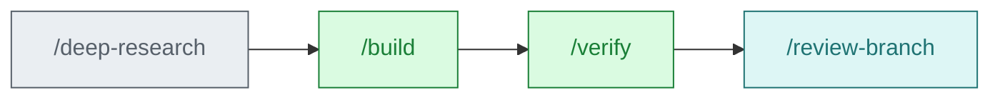
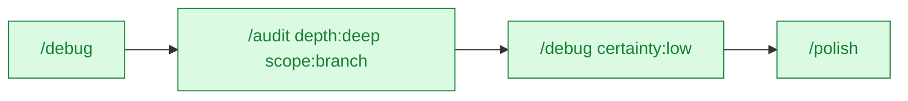
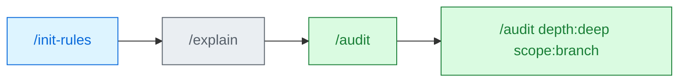
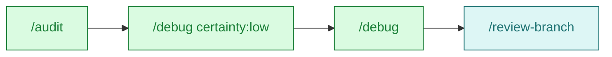
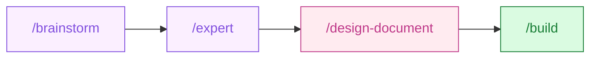
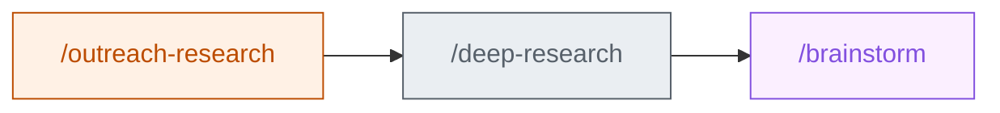
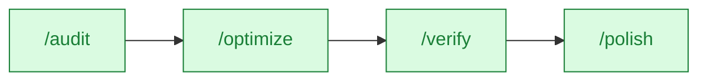
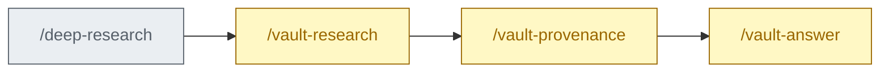

# mozg-pipelines

Multi-agent plugins for [Claude Code](https://claude.com/claude-code). Autonomous development pipelines, code review, deep research, and business intelligence — all as slash commands.

## Workflows

> [!TIP]
> Skills compose. Most real tasks span 3–4 commands across multiple plugins — chain them end-to-end instead of reaching for any single skill in isolation. Click any workflow below to see the flow.

<details open>
<summary><b>Ship a new feature end-to-end</b> &nbsp;·&nbsp; <code>mz-research-pipe</code> + <code>mz-dev-pipe</code> + <code>mz-dev-git</code> &nbsp;&nbsp;<i>3 plugins</i></summary>


```mermaid
flowchart LR
    A["/deep-research"]:::research --> B["/build"]:::pipe
    B --> C["/verify"]:::pipe
    C --> D["/review-branch"]:::git
    classDef research fill:#eaeef2,stroke:#57606a,color:#57606a
    classDef pipe fill:#dafbe1,stroke:#1a7f37,color:#1a7f37
    classDef git fill:#ddf6f5,stroke:#1f7373,color:#1f7373
```

1. **`/deep-research`** — survey trade-offs, cite references, pick an approach
1. **`/build`** — research → plan (approval gate) → parallel code → review → test
1. **`/verify`** — lint + types + tests + coverage, diagnose failures
1. **`/review-branch`** — independent final pass before opening the PR

</details>

<details>
<summary><b>Hunt a production bug</b> &nbsp;·&nbsp; <code>mz-dev-pipe</code></summary>


```mermaid
flowchart LR
    A["/debug"]:::pipe --> B["/audit depth:deep scope:branch"]:::pipe
    B --> C["/debug certainty:low"]:::pipe
    C --> D["/polish"]:::pipe
    classDef pipe fill:#dafbe1,stroke:#1a7f37,color:#1a7f37
```

1. **`/debug`** — reproduce → regression test → diagnose → fix → verify
1. **`/audit depth:deep scope:branch`** — auto-invokes blast-radius: map every caller, test, and type at risk of the patch
1. **`/debug certainty:low`** — prove or disprove "does the same race exist on the refund path" without touching code
1. **`/polish`** — fix-test-review loop until the criteria are met

</details>

<details>
<summary><b>Take over a legacy codebase</b> &nbsp;·&nbsp; <code>mz-dev-base</code> + <code>mz-research-pipe</code> + <code>mz-dev-pipe</code> &nbsp;&nbsp;<i>3 plugins</i></summary>


```mermaid
flowchart LR
    A["/init-rules"]:::base --> B["/explain"]:::research
    B --> C["/audit"]:::pipe
    C --> D["/audit depth:deep scope:branch"]:::pipe
    classDef base fill:#ddf4ff,stroke:#0969da,color:#0969da
    classDef research fill:#eaeef2,stroke:#57606a,color:#57606a
    classDef pipe fill:#dafbe1,stroke:#1a7f37,color:#1a7f37
```

1. **`/init-rules`** — install curated coding rules for the detected languages
1. **`/explain`** — multi-angle walkthrough with Mermaid diagrams of the module
1. **`/audit`** — ranked list of landmines and tech-debt hotspots
1. **`/audit depth:deep scope:branch`** — auto-invokes blast-radius: what shatters before the refactor PR lands

</details>

<details>
<summary><b>Security sweep and remediation</b> &nbsp;·&nbsp; <code>mz-dev-pipe</code> + <code>mz-dev-git</code></summary>


```mermaid
flowchart LR
    A["/audit"]:::pipe --> B["/debug certainty:low"]:::pipe
    B --> C["/debug"]:::pipe
    C --> D["/review-branch"]:::git
    classDef pipe fill:#dafbe1,stroke:#1a7f37,color:#1a7f37
    classDef git fill:#ddf6f5,stroke:#1f7373,color:#1f7373
```

1. **`/audit`** — prioritized vulnerabilities with file:line evidence
1. **`/debug certainty:low`** — verify top critical findings, drop false positives
1. **`/debug`** — TDD-style fix anchored on a regression test
1. **`/review-branch`** — catch any fallout the fix introduced elsewhere

</details>

<details>
<summary><b>Design-driven feature</b> &nbsp;·&nbsp; <code>mz-creative</code> + <code>mz-design</code> + <code>mz-dev-pipe</code> &nbsp;&nbsp;<i>3 plugins</i></summary>


```mermaid
flowchart LR
    A["/brainstorm"]:::creative --> B["/expert"]:::creative
    B --> C["/design-document"]:::design
    C --> D["/build"]:::pipe
    classDef creative fill:#fbefff,stroke:#8250df,color:#8250df
    classDef design fill:#ffebf0,stroke:#bf3989,color:#bf3989
    classDef pipe fill:#dafbe1,stroke:#1a7f37,color:#1a7f37
```

1. **`/brainstorm`** — 5 lens personas → parallel ideation → vote-to-consensus
1. **`/expert`** — Delphi critique (3 rounds) with dedicated report writer
1. **`/design-document`** — draft → 4-critic loop → WCAG 2.2 AA hard gate
1. **`/build`** — plan → code → review → test against the approved spec

</details>

<details>
<summary><b>Outreach package in one evening</b> &nbsp;·&nbsp; <code>mz-biz-outreach</code> + <code>mz-research-pipe</code> + <code>mz-creative</code> &nbsp;&nbsp;<i>3 plugins</i></summary>


```mermaid
flowchart LR
    A["/outreach-research"]:::outreach --> B["/deep-research"]:::research
    B --> C["/brainstorm"]:::creative
    classDef outreach fill:#fff1e5,stroke:#bc4c00,color:#bc4c00
    classDef research fill:#eaeef2,stroke:#57606a,color:#57606a
    classDef creative fill:#fbefff,stroke:#8250df,color:#8250df
```

1. **`/outreach-research`** — strategy → source research → scout → enrich → score → report
1. **`/deep-research`** — domain context to ground outreach in current regulation
1. **`/brainstorm`** — multi-lens positioning ideas tied back to the outreach-research report

</details>

<details>
<summary><b>Performance rescue</b> &nbsp;·&nbsp; <code>mz-dev-pipe</code></summary>


```mermaid
flowchart LR
    A["/audit"]:::pipe --> B["/optimize"]:::pipe
    B --> C["/verify"]:::pipe
    C --> D["/polish"]:::pipe
    classDef pipe fill:#dafbe1,stroke:#1a7f37,color:#1a7f37
```

1. **`/audit`** — ranked performance hotspots with evidence and suspected causes
1. **`/optimize`** — measure a baseline, profile the bottleneck, benchmark candidate speedups, bank verified wins
1. **`/verify`** — prove the optimizations didn't regress behavior or types
1. **`/polish`** — iterative loop until the SLO actually holds

</details>

<details>
<summary><b>Build a knowledge base from scratch</b> &nbsp;·&nbsp; <code>mz-knowledge</code></summary>


```mermaid
flowchart LR
    A["/obsidian-init"]:::know --> B["/vault-ingest"]:::know
    B --> C["/vault-triage"]:::know
    C --> D["/vault-connect"]:::know
    D --> E["/vault-schema"]:::know
    classDef know fill:#fff8c5,stroke:#9a6700,color:#9a6700
```

1. **`/obsidian-init`** — bootstrap vault with CLAUDE.md, folders, schema, templates
1. **`/vault-ingest`** — capture voice memos, screenshots, PDFs, YouTube into fleeting notes
1. **`/vault-triage`** — batch-score inbox, promote to permanent, merge duplicates, discard noise
1. **`/vault-connect`** — suggest wikilinks between new and existing notes
1. **`/vault-schema`** — validate all frontmatter against the schema, migrate violations

</details>

<details>
<summary><b>Ingest research into a knowledge base</b> &nbsp;·&nbsp; <code>mz-knowledge</code> + <code>mz-research-pipe</code></summary>


```mermaid
flowchart LR
    A["/deep-research"]:::research --> B["/vault-research"]:::know
    B --> C["/vault-provenance"]:::know
    C --> D["/vault-answer"]:::know
    classDef research fill:#eaeef2,stroke:#57606a,color:#57606a
    classDef know fill:#fff8c5,stroke:#9a6700,color:#9a6700
```

1. **`/deep-research`** — multi-agent web research on a topic, produces a structured report
1. **`/vault-research`** — atomize the report into permanent notes with link suggestions
1. **`/vault-provenance`** — classify each note's claims by epistemic status
1. **`/vault-answer`** — query the vault with grounded, citation-backed answers

</details>

## Quick Start

```bash
# Add the marketplace
claude plugin marketplace add DoctorMozg/claude-pipelines

# Install the plugins you need
claude plugin install mz-dev-base       # Standalone agents + rules
claude plugin install mz-dev-git        # Branch & GitHub PR review
claude plugin install mz-dev-pipe       # Autonomous dev pipelines
claude plugin install mz-research-pipe  # Research & content pipelines
claude plugin install mz-biz-outreach   # Business lead generation
claude plugin install mz-job-outreach   # Job & freelance hunting
claude plugin install mz-creative       # Multi-perspective panels + writing
claude plugin install mz-funny          # Character-voice code roasting
claude plugin install mz-design         # UI/UX design documents
claude plugin install mz-memory         # Cross-session project memory
claude plugin install mz-knowledge      # Obsidian knowledge base
```

After installation, skills are available as slash commands:

```
/build implement OAuth2 PKCE flow for the auth module
/audit scope:branch security
/debug "KeyError: 'user_id' in process_payment"
/review-branch
/outreach-research find AI startups in Berlin for consulting partnerships
```

## Plugins

### [`mz-dev-base`](plugins/mz-dev-base/) — Foundation

Standalone agents and skills for everyday development. No pipeline orchestration — each tool works independently.

| Skill               | Command                                                    | What it does                                                        |
| ------------------- | ---------------------------------------------------------- | ------------------------------------------------------------------- |
| **init-rules**      | `/init-rules [project\|global] [--target=rules\|claudemd]` | Installs curated coding rules as files or CLAUDE.md sentinel blocks |
| **construct-skill** | `/construct-skill <intent>`                                | Drafts a new skill through a RED/GREEN/REFACTOR authoring loop      |

2 user-facing agents: code-reviewer (single-file/staged-diff review) and technical-writer (source-grounded docs). Ships 14 curated coding rules installable via `/init-rules`, plus a `using-mozg-pipelines` routing map loaded into every session.

**[Full documentation →](plugins/mz-dev-base/)**

______________________________________________________________________

### [`mz-dev-git`](plugins/mz-dev-git/) — Git & GitHub Review Workflows

Multi-lens deep review for local branches and GitHub pull requests. Runs five parallel code-review specialists (bugs, security, architecture, performance, maintainability) per change, plus a daily GitHub PR triage and per-PR deep-review pipeline.

| Skill                | Command                    | What it does                                                                         |
| -------------------- | -------------------------- | ------------------------------------------------------------------------------------ |
| **review-branch**    | `/review-branch [base]`    | Walks every branch change, fans out 5 code-lens agents, produces a structured report |
| **github-review-pr** | `/github-review-pr <URL>`  | Deep-reviews a GitHub PR in an isolated worktree, with severity-labeled findings     |
| **github-scan-prs**  | `/github-scan-prs [repos]` | Triages PRs across repos (review-requested, mentioned, assigned, changes-requested)  |

11 agents total: 2 orchestrators (branch-reviewer, github-pr-reviewer) plus 9 support agents (branch-info-collector, github-pr-scanner, github-pr-info-scorer, github-pr-data-fetcher, code-lens-{bugs,security,architecture,performance,maintainability}). Cross-plugin: branch-reviewer and github-pr-reviewer dispatch `pipeline-web-researcher` from `mz-dev-pipe` for unfamiliar domain topics — install both plugins for the full experience.

**[Full documentation →](plugins/mz-dev-git/)**

______________________________________________________________________

### [`mz-dev-pipe`](plugins/mz-dev-pipe/) — Autonomous Dev Pipelines

Multi-agent orchestration skills that run full development workflows. Each skill coordinates specialized agents through phased pipelines with user approval gates.

| Skill               | Command                     | What it does                                                                                                                 |
| ------------------- | --------------------------- | ---------------------------------------------------------------------------------------------------------------------------- |
| **build**           | `/build <task>`             | Research → plan → code → review → test                                                                                       |
| **audit**           | `/audit [focus]`            | Multi-lens codebase scan (correctness, security, performance, maintainability, reliability) → ranked fixes                   |
| **debug**           | `/debug <bug report>`       | Reproduce → diagnose → regression test (TDD) → fix → verify; `certainty:low` investigates a hypothesis without touching code |
| **verify**          | `/verify [scope]`           | Tests + linters + type checks + coverage analysis + failure diagnosis                                                        |
| **polish**          | `/polish <criteria>`        | Iterative fix-test-review loop until criteria are met                                                                        |
| **cleanup**         | `/cleanup <scope>`          | Import-graph chunking → parallel optimization → mirrored review                                                              |
| **optimize**        | `/optimize <target + goal>` | Measure-first loop: baseline → profile → hypothesize → benchmark candidates → bank verified speedups                         |
| **decomment**       | `/decomment [scope]`        | Strips AI-flavored comments and docstrings from code, never touching executable logic                                        |
| **clean-leftovers** | `/clean-leftovers [scope]`  | Removes AI-generation leftovers — signatures, phase markers, planning comments, half-implementations                         |

17 specialized agents (researcher, web-researcher, planner, plan-reviewer, coder, code-reviewer, test-writer, test-reviewer, test-runner, lint-runner, tooling-detector, optimizer, completeness-checker, decomment-proposer, leftover-cleaner, measure-runner, perf-candidate).

All pipeline skills support `scope:branch|global|working` to constrain which files agents may edit.

**[Full documentation →](plugins/mz-dev-pipe/)**

______________________________________________________________________

### [`mz-research-pipe`](plugins/mz-research-pipe/) — Research & Content Pipelines

Research and content skills spun off from `mz-dev-pipe` — they produce reports and rewritten artifacts instead of mutating application code.

| Skill             | Command                  | What it does                                                                                         |
| ----------------- | ------------------------ | ---------------------------------------------------------------------------------------------------- |
| **deep-research** | `/deep-research <topic>` | Decompose → approval → parallel web research → cross-reference synthesis → report                    |
| **combine**       | `/combine <task>`        | Synthesizes prior pipeline output (`.mz/research/`, `.mz/task/`, git) into one task-adaptive report  |
| **explain**       | `/explain <scope>`       | Multi-angle code research → comprehensive report with Mermaid diagrams                               |
| **translate**     | `/translate <request>`   | Discovery → glossary → plan → parallel translation → tiered verification, preserving markdown & code |

1 agent (pipeline-translator). `/deep-research`, `/combine`, and `/explain` reuse `pipeline-web-researcher` and `pipeline-researcher` from `mz-dev-pipe` — install both plugins together.

**[Full documentation →](plugins/mz-research-pipe/)**

______________________________________________________________________

### [`mz-biz-outreach`](plugins/mz-biz-outreach/) — Business Intelligence

Autonomous lead-generation pipeline plus a dossier-card lifecycle: discover companies, deepen their cards, and log every interaction.

| Skill                       | Command                                       | What it does                                                                            |
| --------------------------- | --------------------------------------------- | --------------------------------------------------------------------------------------- |
| **outreach-research**       | `/outreach-research <goal>`                   | Strategy → source research → scout → scan → enrich → score → per-company cards → report |
| **outreach-enrich-company** | `/outreach-enrich-company <card>`             | Deepens a card via 5 specialist subagents and drafts naturalized outreach letters       |
| **outreach-update-card**    | `/outreach-update-card <card> action:"<...>"` | Appends a dated interaction entry to a company card's history                           |

11 specialized agents covering strategy, source research, company discovery, reputation scanning, contact finding, news monitoring, growth analysis, tech stack analysis, enrichment orchestration, card writing, and reporting.

**[Full documentation →](plugins/mz-biz-outreach/)**

______________________________________________________________________

### [`mz-job-outreach`](plugins/mz-job-outreach/) — Job & Freelance Hunting

Autonomous job-hunt and freelance-hunt pipelines — full CV-to-listings discovery plus targeted one-shot output for salaried roles and freelance gigs.

| Skill                  | Command                           | What it does                                                                          |
| ---------------------- | --------------------------------- | ------------------------------------------------------------------------------------- |
| **job-search**         | `/job-search <preferences>`       | CV-to-vacancies: strategy → scout boards → score → recruiter contacts → cover letters |
| **job-recruiter-info** | `/job-recruiter-info <target>`    | One-shot recruiter / hiring-manager discovery for a single role or company            |
| **freelance-search**   | `/freelance-search <preferences>` | CV-to-gigs across vetted networks and regional boards (Upwork / Fiverr excluded)      |
| **freelance-pitch**    | `/freelance-pitch <gig>`          | Per-gig grounded proposal (≤350 words) citing gig scope and budget verbatim           |

12 specialized agents covering CV strategy, board scouting, two-stage scoring, recruiter contact lookup, cover-letter writing, freelance proposal drafting, and reporting.

**[Full documentation →](plugins/mz-job-outreach/)**

______________________________________________________________________

### [`mz-creative`](plugins/mz-creative/) — Multi-Perspective Panels & Creative Writing

Two flavors of skill share this plugin. **Panels** — `/brainstorm` and `/expert` — drive a unified roster of **16 lens agents** (engineer, artist, philosopher, mathematician, scientist, economist, storyteller, futurist, psychologist, historian, cto, data, devops, product, security, seo) through ideation or Delphi-style critique. **Writing pipelines** — `/document`, `/naturalize`, `/copywrite` — produce technical documentation, naturalize AI-generated prose, and write promotional copy, with the `document` and `copywrite` skills running an automatic naturalize pass on every output.

| Skill          | Command                     | What it does                                                                   |
| -------------- | --------------------------- | ------------------------------------------------------------------------------ |
| **brainstorm** | `/brainstorm <topic>`       | Panel selection → parallel ideation → synthesis → voting rounds                |
| **expert**     | `/expert <idea>`            | Panel selection → 3 rounds (view → summary → react) → dedicated report writer  |
| **document**   | `/document <topic>`         | Codebase research → user approval → expert-technical-writer → auto-naturalize  |
| **naturalize** | `/naturalize <text\|@file>` | AI-pattern analysis → user approval → expert-naturalizer (+ optional in-place) |
| **copywrite**  | `/copywrite <topic>`        | Positioning research → brief approval → expert-copywriter → auto-naturalize    |

22 agents total: 16 lens personas (shared between brainstorm and expert) plus 6 support agents (expert-researcher, expert-round-synthesizer, expert-report-writer, expert-technical-writer, expert-naturalizer, expert-copywriter).

**[Full documentation →](plugins/mz-creative/)**

______________________________________________________________________

### [`mz-funny`](plugins/mz-funny/) — Character-Voice Code Roasting

Evidence-anchored code roasting in 7 character voices. Each persona is a first-class agent that can only embellish real findings from a static-analysis-plus-docs-plus-web-research dossier — no fabrication. Pick a voice, point at a file or a branch, get roasted.

| Skill        | Command                        | What it does                                                                            |
| ------------ | ------------------------------ | --------------------------------------------------------------------------------------- |
| **do-roast** | `/do-roast <persona> <target>` | Resolve target → analyze → dossier → persona dispatch → roast report with inline teaser |

7 persona agents (roast-caveman, roast-wh40k-ork, roast-pirate, roast-viking, roast-dwarf, roast-drill-sergeant, roast-yoda) — each standalone-invocable as a creative consultant.

**[Full documentation →](plugins/mz-funny/)**

______________________________________________________________________

### [`mz-design`](plugins/mz-design/) — UI/UX Design Documents

Iterative design-specification skill that drafts a UI/UX document then refines it through four parallel specialist critics (visual layout, UX flows, color/typography, accessibility) with a WCAG 2.2 AA hard gate. Up to 5 critique iterations until all critics approve and zero contrast violations remain.

| Skill               | Command            | What it does                                                                    |
| ------------------- | ------------------ | ------------------------------------------------------------------------------- |
| **design-document** | `/design-document` | Intake → research → draft → 4-critic loop → WCAG-gated approval → final summary |

8 specialized agents (researcher, document-writer, revision-writer, critique-synthesizer, ui-designer, ux-designer, art-designer, accessibility-specialist) and 3 lazy-loaded reference files (Nielsen heuristics, WCAG thresholds, canonical spec template).

**[Full documentation →](plugins/mz-design/)**

______________________________________________________________________

### [`mz-memory`](plugins/mz-memory/) — Project Memory

Cross-session project memory that persists knowledge automatically — injects on session start, captures completed tasks on session end, re-injects after compaction, snapshots handover state before compaction, and selectively injects relevant memory per prompt.

| Hook                  | Event            | What it does                                              |
| --------------------- | ---------------- | --------------------------------------------------------- |
| **Memory inject**     | SessionStart     | Loads `.mz/memory/MEMORY.md` into context                 |
| **Memory capture**    | SessionEnd       | Captures completed task summaries, prunes to 200 lines    |
| **Memory reinject**   | PostCompact      | Re-injects memory after context compaction                |
| **Memory precompact** | PreCompact       | Snapshots in-flight working state before compaction       |
| **Memory prompt**     | UserPromptSubmit | Selectively injects memory matching the prompt's keywords |

| Skill           | Command                       | What it does                                                    |
| --------------- | ----------------------------- | --------------------------------------------------------------- |
| **memory-note** | `/memory-note [--log] <note>` | Manually pins a note to project memory through an approval gate |

Pairs with `mz-dev-pipe` agents that have native `memory: project` for per-agent persistent memory.

**[Full documentation →](plugins/mz-memory/)**

______________________________________________________________________

### [`mz-knowledge`](plugins/mz-knowledge/) — Obsidian Knowledge Base

Full lifecycle for a personal Obsidian vault — bootstrap, capture, atomize, triage, link, review, and query. Every skill reads the vault's CLAUDE.md for conventions and writes state to `.mz/task/`.

| Skill                 | Command                             | What it does                                                             |
| --------------------- | ----------------------------------- | ------------------------------------------------------------------------ |
| **obsidian-init**     | `/obsidian-init <vault path>`       | Bootstrap vault with CLAUDE.md, PARA+Zettelkasten folders, schema        |
| **vault-ingest**      | `/vault-ingest <path or URL>`       | Capture voice/image/PDF/YouTube → transcription → fleeting note          |
| **process-notes**     | `/process-notes <note path>`        | Atomize fleeting notes into permanent notes with frontmatter             |
| **vault-triage**      | `/vault-triage`                     | Batch-score inbox notes → promote / merge / discard / defer              |
| **vault-research**    | `/vault-research <report path>`     | Ingest research reports → atomic permanent notes + link suggestions      |
| **vault-schema**      | `/vault-schema [validate\|migrate]` | Validate frontmatter against YAML schema, propose migrations             |
| **vault-connect**     | `/vault-connect <note path>`        | Suggest `[[wikilinks]]` between notes based on content similarity        |
| **vault-provenance**  | `/vault-provenance <note path>`     | Classify claims by epistemic status (first-hand/cited/inferred/received) |
| **vault-answer**      | `/vault-answer <question>`          | Grounded Q&A with inline `[[citations]]` from vault content              |
| **vault-refactor**    | `/vault-refactor <rename spec>`     | Safe bulk renames with link-graph updates and rollback                   |
| **vault-review**      | `/vault-review`                     | Periodic review of permanent notes for staleness and accuracy            |
| **vault-health**      | `/vault-health`                     | Orphan detection, dead wikilinks, missing frontmatter                    |
| **obsidian-bases**    | `/obsidian-bases`                   | Obsidian Bases `.base` file syntax reference (filters, formulas, views)  |
| **obsidian-markdown** | `/obsidian-markdown`                | Obsidian-flavored markdown syntax reference                              |
| **obsidian-cli**      | `/obsidian-cli`                     | Obsidian URI scheme and CLI reference                                    |

11 agents (capture-normalizer, triage-scorer, atomization-proposer, link-suggester, provenance-tracer, schema-validator, vault-query-answerer, vault-refactor-scanner, vault-refactor-writer, vault-audit-collector, moc-gap-detector).

**[Full documentation →](plugins/mz-knowledge/)**

## How It Works

Each plugin provides **agents** (specialized worker processes) and **skills** (orchestrator prompts that coordinate agents through multi-phase pipelines).

```
User runs /build "add rate limiting to the API"
  │
  ├─ Phase 1: Researcher agent explores codebase
  ├─ Phase 2: Planner agent creates implementation plan
  │    └─ Plan reviewer validates the plan
  ├─ Phase 3: User approves the plan
  ├─ Phase 4: Coder agents implement in parallel (1-8 workers)
  │    └─ Code reviewers validate each chunk
  ├─ Phase 5: Test writer adds tests
  │    └─ Test reviewer checks coverage + quality
  ├─ Phase 6: Completeness checker verifies everything
  └─ Final: Summary report
```

Pipelines are designed around:

- **Parallel fan-out**: independent work units run simultaneously across multiple agents
- **User approval gates**: no code changes without your sign-off on the plan
- **Iterative convergence**: fix → verify → review loops with bounded retries
- **Progressive disclosure**: orchestrators load phase files on-demand to minimize token cost

## Contributing

See [CLAUDE.md](CLAUDE.md) for repository structure and conventions.

## Credits

Some rules in `mz-dev-base` were inspired by [iamfakeguru/claude-md](https://github.com/iamfakeguru/claude-md).

## License

MIT
